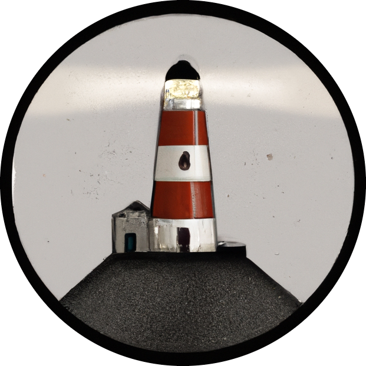

# beacon

  

This repository proposes benchmark cases for DRL-based flow control. The considered cases are voluntarily limited in CPU requirements, so they can be used for prototyping on local machines while still presenting realistic flow control aspects.

## `shkadov`

The agent actuates several jets to damp the instabilities of a falling fluid film (original approach was from Belus et al. in <a href="https://aip.scitation.org/doi/10.1063/1.5132378">this paper</a>.) States are the heights of the fluid upstream of each jet. One episode represents 400 actions, and the training is made on 300000 transitions for 1 to 10 jets (approx. 30 mins on a laptop with PPO algorithm).

  

