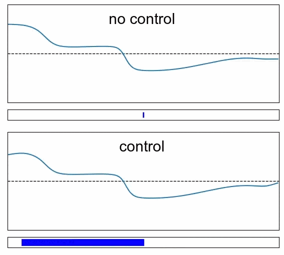
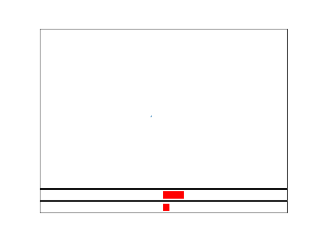

# beacon

  

This repository proposes benchmark cases for DRL-based flow control. The considered cases are voluntarily limited in CPU requirements, so they can be used for prototyping on local machines while still presenting realistic flow control aspects. If you use this library in the context of your research work, please consider citing:

TO COMPLETE

The latter paper also serves as a documentation for the library.

 
 
 
 
 
 
 
 
 

## `shkadov`

The agent actuates several jets to damp the instabilities of a falling fluid film (original approach was from Belus et al. in <a href="https://aip.scitation.org/doi/10.1063/1.5132378">this paper</a>.) States are the mass flow rates of the fluid upstream of each jet. One episode represents 400 actions, and the training is made on 200000 transitions for 10 jets.

  

 
 

## `rayleigh`

  

The agent learns to disable the convection in a Rayleigh-Benard cell by locally modifying the temperature of different segments on the bottom plate (original approach was from Beintema et al. in <a href="https://www.tandfonline.com/doi/full/10.1080/14685248.2020.1797059">this paper</a>.) States are the temperature and velocities collected at probe points in the domain. One episode represents 100 actions, and the training is made on 600000 transitions.

 
 
 
 
 
 
 
 
 
 
 
 
 
 

## `mixing`

  

The agent learns to optimize the mixing of a passive scalar quantity in a cavity by selecting the lid velocities. States are the scalar concentration and velocities collected at probe points in the domain. One episode represents 100 actions, and the training is made on 100000 transitions.

 
 
 
 
 
 
 
 
 
 
 
 

## `lorenz`

  

The agent learns to lock the Lorenz attractor in the `x<0` quadrant by acting on a forcing term in the ODE system (original approach was from Beintema et al. in <a href="https://www.tandfonline.com/doi/full/10.1080/14685248.2020.1797059">this paper</a>.) States are the `(x,y,z)` variables and their time derivatives. One episode represents 500 actions, and the training is made on 2000000 transitions.

 
 
 
 
 
 
 
 
 
 
 
 
 
 
 
 
 
 

## `burgers`

  

The agent controls a forcing term corresponding to an actuator located in the middle of the 1D domain. The goal is to suppress the noise generated at the inlet. States are the velocities sampled upstream of the actuator. One episode represents 200 actions, and the training is made on 500000 transitions.

 
 
 
 

## `sloshing`

  

The agent controls the acceleration of a tank containing a fluid in order to damp the sloshing movement initiated during an excitation pahse. State vector is a downsampled mass flow rate vector. One episode represents 200 actions, and the training is made on 200000 transitions.

 
 
 
 
 
 
 
 
 
 

## `vortex`

  

The agent controls the amplitude and phase of a forcing term acting on a model representing a cylinder attached to the wall with a damper-spring, immersed in a flow at Reynolds 50. One episode represents 800 actions, and the training is made on 1000000 transitions.
